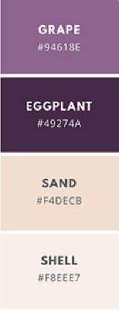

# Repository Nadel & Kunst

Dieses Projekt wird im Wintersemester des Schuljahres 18/19 von den Schülern:  
*Maciej Dzialoszynski*, *Sebastian Grünewald*, *David Jovanovic* und *Jordi Rieder*   
geführt.

:stuck_out_tongue_closed_eyes:

---

## Projektregeln

### Verwendung von Scss:
Die Ordnerstruktur ist so aufgebaut, dass jede Subseite ihren eigenen styles-Ordner enthält.  
In diesem werden die benötigten scss Dateien gespeichert.  
Neue Scss-Dateien **müssen** unbedingt in scssCompiler/main.scss importiert werden.  
Dies dient dazu, damit nur ein einziges scss-File kompiliert werden muss.

Um Kompilieren zu können, muss das Programm **Koala** installiert werden.  
Dort muss nun der Ordner **scssCompiler** ausgewählt werden.  
Danach muss man das Outputfile **style.min.css** auswählen, welches sich in *themesAndCss* befindet.

Alle Variablen, die sich in themes.scss befinden, können somit auch in allen anderen, in main.scss importierten Files verwendet werden.

### Benennung von Scss-Files:
Jedes Scss-File wird genauso benannt, wie das .html, .php, .js, etc. -File, zu welchem es gehört.  
**Beispiel:** index.html … index.scss  

### Benennung von Css-Klassen:
Jede Css-Klasse wird nach folgender Struktur benannt:  
**Struktur:** filename&#95;&#95;klassenname  
**Beispiel:** index&#95;&#95;headline

### Dokumentation:
Jedes File bekommt einen Dokumentationskommentar, welcher die ersten Paar Zeilen des Files einnimmt. Was muss enthalten sein?
Beschreibung des Files, Abhängige Files (CSS ausgenommen), Autor, letzte Änderung  
**Beispiel:**

```
/**
* Dieses File beinhaltet die Anmeldung zum Webshop….
* Abhängige Files sind: reg.php, test.html
* Autor: Sebi Grünwald
* Letzte Änderung: 17.11.2018  
*/
```

Außerdem wird jedes File ausreichend kommentiert, außer, es ist selbstverständlich. 

### Themes:
Es wird ein eigener Themes-Ordner erstellt; hier setzen wir alle Standard-Sachen fest, wie Farben, Schriftgrößen, etc.

### Farben:
Grape - #94618E ; Eggplant - #49274A ; Sand - #F4DECB ; Shell - #F8EEE7  
Grape - R:148 G:97 B:142



### Ordnerstruktur: 
Es darf nicht vorkommen, dass Dateinamen mehrmals verwendet werden, wie index.html und index.php.
Jeder Name darf nur ein Mal vorkommen, unabhängig von der Dateiendung.
Im Oberverzeichnis **code** sind die 3 Sub-Seiten **homepage**, **webshop** und **admin_interface** enthalten.  
Jede von diesen beinhaltet mehrere Ordner, in welche dann die jeweiligen Dateien gespeichert werden.